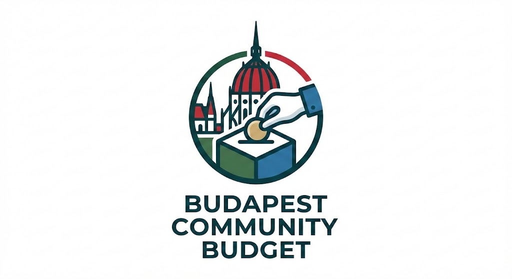
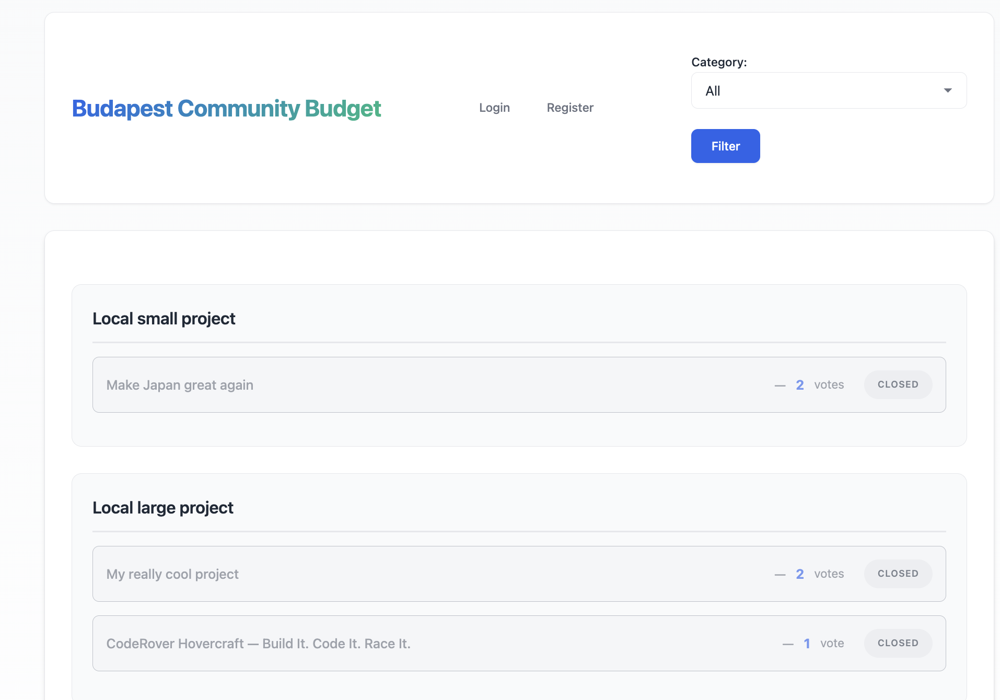
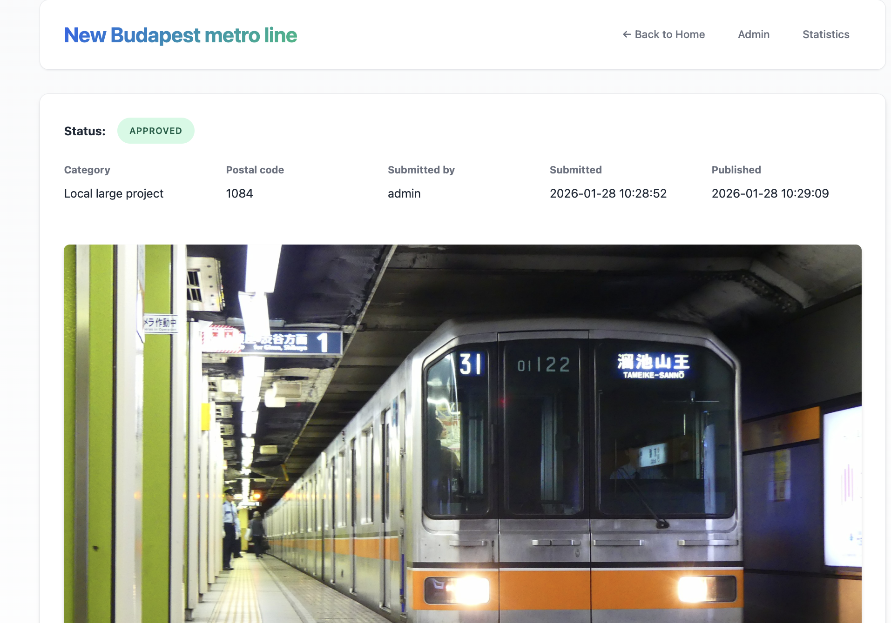

  

# 🏙️ Budapest Community Budget

## Overview

**Budapest Community Budget** is a web application that allows residents to participate in the city’s decision-making process by submitting project proposals and voting on ideas they support.

The system focuses on **transparency**, **fair voting rules**, and **clear project lifecycle management**, enabling community-driven development through a structured digital platform.

**Course:** Web Programming (PHP Assignment)  
**Tech stack:** Vanilla PHP, HTML, CSS, JavaScript (AJAX / Fetch API), JSON-based data storage

---

## Features

### 👀 Public & Guest Access
- Browse all approved and published projects
- Filter projects by category (e.g. Green Budapest, Local Small Project)
- View detailed project descriptions and live vote counts
- User registration and login

---

### 👤 Authenticated Users
- Submit new project proposals with validation:
  - Title
  - Description
  - Category
  - Image upload
  - Valid district postal code
- Track personal project status:
  - Pending
  - Approved
  - Rejected
  - Rework requested
- Vote on published projects with strict rules:
  - Maximum **3 votes per category**
  - Maximum **1 vote per project**
  - Votes can be withdrawn within **2 weeks**
  - Voting closes **2 weeks after project publication**

---

### 🛡️ Administrator
- Moderate submitted projects
- Approve, reject, or request rework with feedback
- View statistics:
  - Most popular projects
  - Top projects per category

---

## Resources

